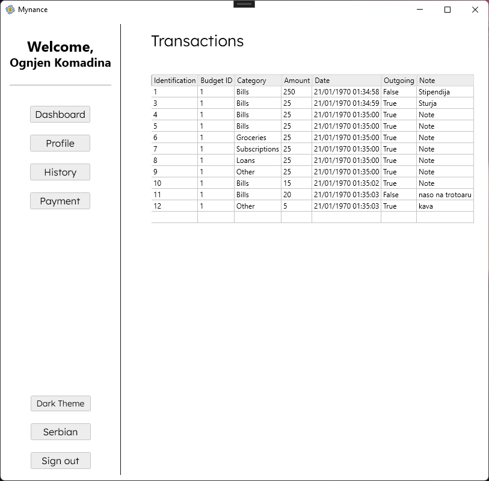

# User guide

## Content

- [User guide](#user-guide)
  - [Content](#content)
  - [Beginning](#beginning)
  - [Login and registration](#login-and-registration)
  - [User control panel](#user-control-panel)
  - [Admin control panel](#admin-control-panel)
  - [Viewing payment history](#viewing-payment-history)
  - [Edit profile](#edit-profile)
  - [Payment](#payment)
    - [Payments](#payments)
    - [Payments](#payments-1)
  - [Personalization](#personalization)
    - [Thematization](#thematization)
    - [Localization](#localization)

## Beginning

1. Open the application and you will be on the **Login Page**.

1. If you are a new user, click the **Don't have an account? Register here!** to create an account.

3. Fill out the registration form with your information and you can start using the **Mynance** application services!

## Login and registration

1. Once you've registered, go back to the **Login Page** and enter your credentials.
2. Click the **Login** button to access your account.

## User control panel

1. After login, you will be redirected to **Landing User** page.

2. From here you can access various features using the **Side Navigation Bar** on the left.

## Admin control panel

1. If you are an administrator, after logging in you will be redirected to the **Landing Administrator** page.
2. From here you can access the administrative functions using the **Side Navigation Bar**.

## Viewing payment history

1. To view your history, go to the **History Page** by clicking on **History**.
2. Here you can see your past activities and transactions.

## Edit profile

1. To view your profile, go to **Profile Page**.

## Payment
### Payments
1. To make a payment, go to the **Payment Page** by clicking on **Payments**.

2. In order to make a payment for certain obligations, you can fill out the form, enter the amount of money (using the current regional separator, more precisely `,`), select the payment category from the drop-down menu, and, if you wish, fill in a *comment* of the payment.

3. By clicking on "Payout" you have made a payment, and you can view it in the payment history. Your budget in that category will also be updated.
4.
### Payments
1. According to the payments, you can also make a payment to your account (current monthly budget), by filling out the form shown on the page.

2. Your budget will be increased by the given amount, as can be seen on the home page.

## Personalization
### Thematization
You can change the theme by clicking the *"... theme"* button, where you can choose from your preferred theme. Your selection will be saved when you log out of the application.

### Localization
If you want to change your application language, you can do the same by clicking on the "English" button, which will update the language used to display the content on the application. Your selection will be saved when you log out of the application.

That's it! With these steps, you should be able to navigate and use the app.
