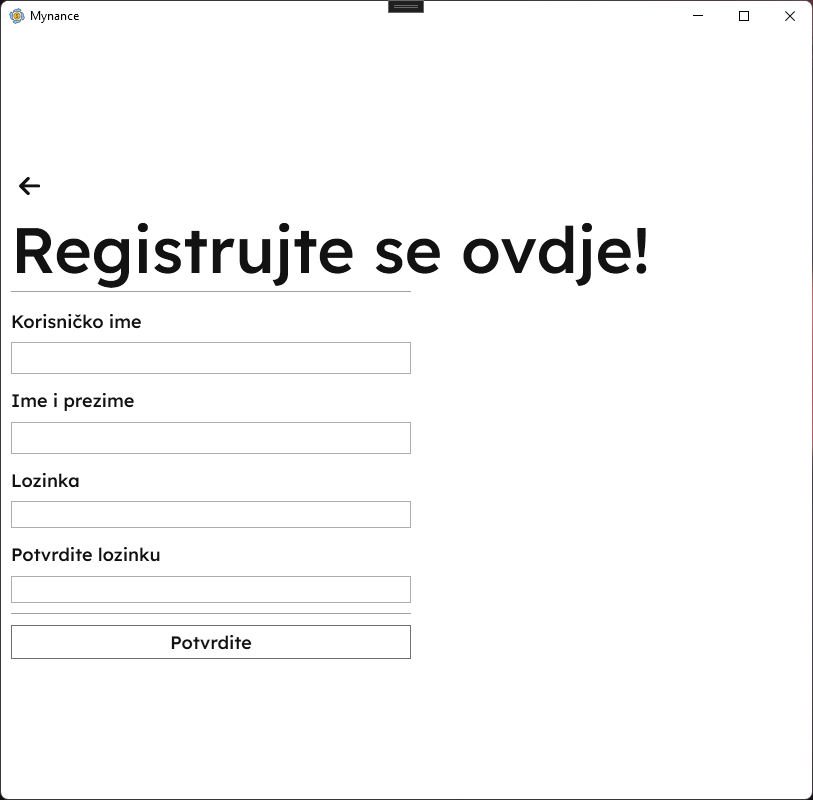

# Vodič za upotrebu

## Sadržaj

- [Vodič za upotrebu](#vodič-za-upotrebu)
  - [Sadržaj](#sadržaj)
  - [Početak](#početak)
  - [Prijava i registracija](#prijava-i-registracija)
  - [Korisnička kontrolna tabla](#korisnička-kontrolna-tabla)
  - [Administratorska kontrolna tabla](#administratorska-kontrolna-tabla)
  - [Pregledanje istorije plaćanja](#pregledanje-istorije-plaćanja)
  - [Uređivanje profila](#uređivanje-profila)
  - [Plaćanje](#plaćanje)
    - [Isplate](#isplate)
    - [Uplate](#uplate)
  - [Personalizacija](#personalizacija)
    - [Tematizacija](#tematizacija)
    - [Lokalizacija](#lokalizacija)

## Početak

1. Otvorite aplikaciju i bićete na **Stranici za prijavu**.

1. Ako ste novi korisnik, kliknite na dugme **Nemate nalog? Registrujte se ovdje!** da kreirate nalog.

3. Popunite formular za registraciju svojim podacima i možete početi koristiti usluge **Mynance** aplikacije!

## Prijava i registracija

1. Kada se registrujete, vratite se na **Stranicu za prijavu** i unesite svoje kredencijale.
2. Kliknite na dugme **Prijava** da pristupite svom nalogu.

## Korisnička kontrolna tabla

1. Nakon prijave, bit ćete preusmjereni na stranicu **Landing User**.

2. Odavde možete pristupiti raznim funkcijama pomoću **Bočne navigacijske trake** sa lijeve strane.

## Administratorska kontrolna tabla

1. Ako ste administrator, nakon prijave ćete biti preusmjereni na stranicu **Landing Administrator**.
2. Odavde možete pristupiti administrativnim funkcijama koristeći **Bočnu navigacijsku traku**.

## Pregledanje istorije plaćanja

1. Da vidite svoju istoriju, idite na **Stranicu istorije** klikom na **Istorija**.
2. Ovdje možete vidjeti svoje prethodne aktivnosti i transakcije.

## Uređivanje profila

1. Da pregledate svoj profil, idite na **Stranicu profila**.

## Plaćanje
### Isplate
1. Da izvršite uplatu, idite na **Stranicu za plaćanje** klikom na **Plaćanja**.

2. Da biste izvršili isplatu na pojedine obaveze, možete popuniti formu, unijeti količinu novca (upotrebom trenutnog regijskog separatora, tačnije `,`), odabrati kategoriju uplate iz padajućeg menija, te, ukoliko želite popuniti *komentar* uplate. 

3. Klikom na "Isplati" ste napravili isplatu, te istu možete pogledati u istoriji plaćanja. Vaš budžet u datoj kategoriji će se takođe ažurirati.
4. 
### Uplate
1. Shodno isplatama, možete i izvršiti uplatu na svoj račun (trenutni mjesečni budžet), popunjavanjem prikazane forme na stranici.

2. Vaš budžet će biti uvećan za dati iznos, kao što se može vidjeti na početnoj stranici.

## Personalizacija
### Tematizacija
Temu možete promijeniti klikom na dugme *"... tema"*, pri čemu možete birati između preferirane teme. Vaš izbor će biti sačuvan kada se odjavite iz aplikacije.

### Lokalizacija
Ukoliko želite da promijenite Vaš jezik aplikacije, isto možete uraditi klikom na dugme "Engleski", čime ćete ažurirati jezik upotrijebljen za prikaz sadržaja na aplikaciji. Vaš izbor će biti sačuvan prilikom odjave iz aplikacije.

To je to! Uz ove korake, trebali biste biti u mogućnosti da navigirate i koristite aplikaciju.